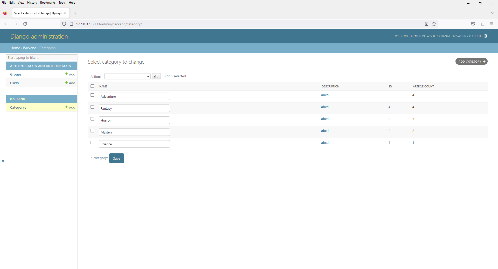

# Chapter 14 - Book Shop - Admin with Inline Editing Feature
 


2. open `admin.py`

```
from django.contrib import admin
from .models import Category


# Register your models here.
class CategoryAdmin(admin.ModelAdmin):
    list_display = ('name', 'id', 'article_count',)

    # Specify 'name' as the field to be linked to the change view
    list_display_links = ('id',)

    # Allow inline editing of the 'name' field
    list_editable = ('name',)

admin.site.register(Category, CategoryAdmin)
```

3. Inline Editing

You can enable inline editing of topic fields directly from the list view. For example, you can allow admins to edit the name of a topic without going to the edit page: