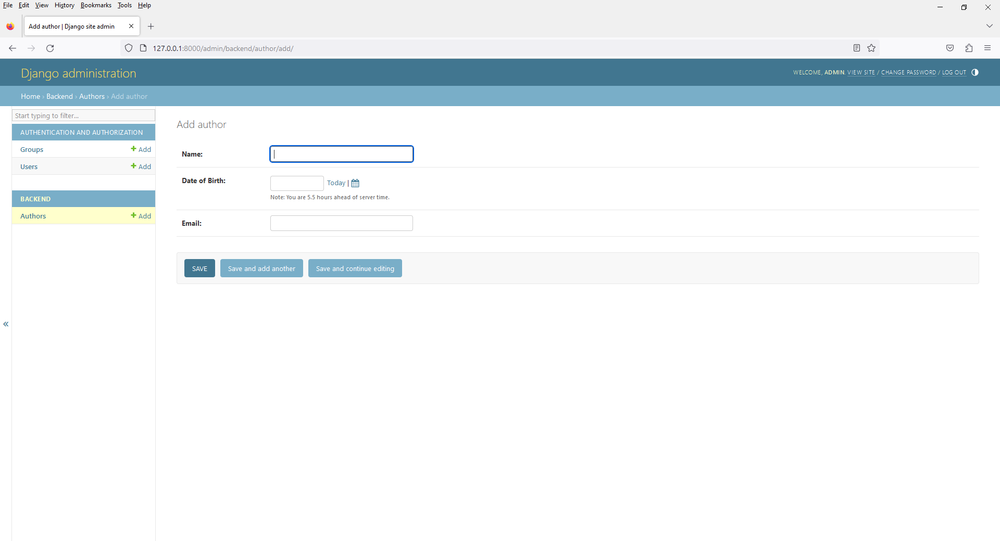
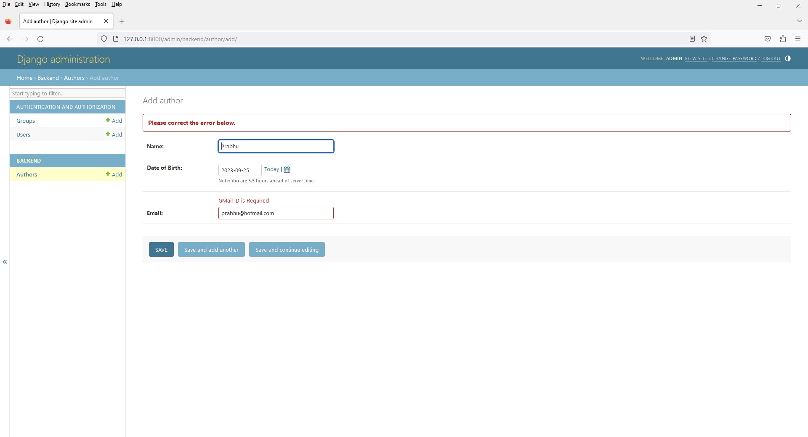
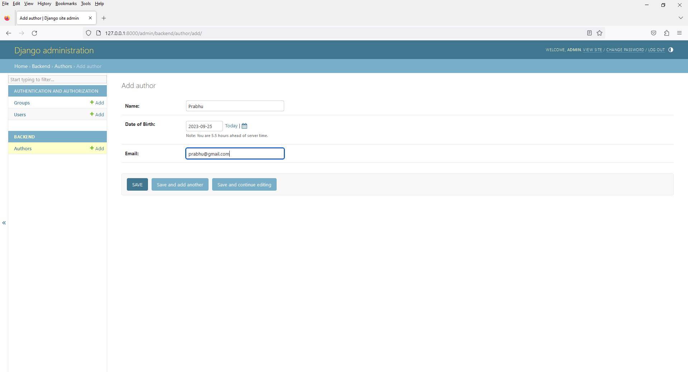
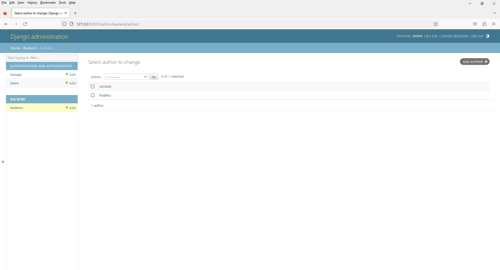
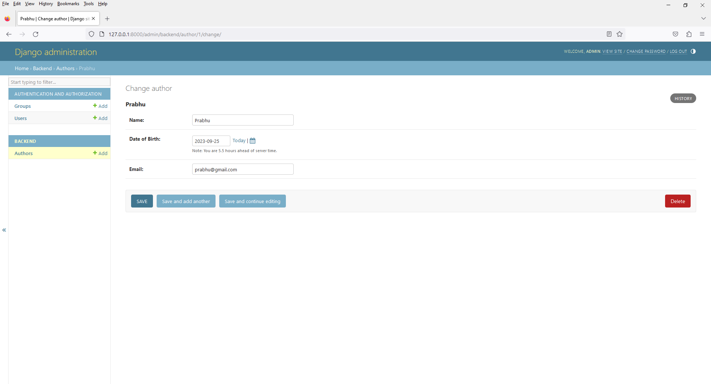

# Chapter 15 - Custom Field Validations in Django Models
 
1. Introduction

This Custom Field Validations in Django Models revolves around how to add custom validation to a particular field. 

For example to add validation of an email to a CharField by specifying a particular format. 

There can be multiple ways on how to achieve custom validation. In this article, 
we are going to show it from the model itself so that you need not manipulate it elsewhere. 
These Validation are run when you are trying to create an instance of a model. 

Technically, this validation is implemented after you run ModelName.objects.create(data = data).

Syntax

field_name = models.Field(validators = [function 1, function 2])

https://www.geeksforgeeks.org/custom-field-validations-in-django-models/?ref=lbp












8. open `validators.py`

```
from django.core.exceptions import ValidationError


# creating a validator function
def validate_author_gmail_mail(value):
    if "@gmail.com" in value:
        return value
    else:
        raise ValidationError("GMail ID is Required")
```

9. open `models.py`

```
from django.db import models

from backend.validators import validate_author_gmail_mail

class Author(models.Model):

    id = models.BigAutoField(primary_key=True)

    name = models.CharField(max_length=255)

    dob = models.DateField(
        verbose_name="Date of Birth"
    )

    email = models.EmailField(
        validators=[validate_author_gmail_mail]
    )

    def __str__(self):
        return self.name

    class Meta:
        db_table = "author"
```

10. open `admin.py`

```
from django.contrib import admin
from .models import Author

# Register your models here.
admin.site.register(Author)
```