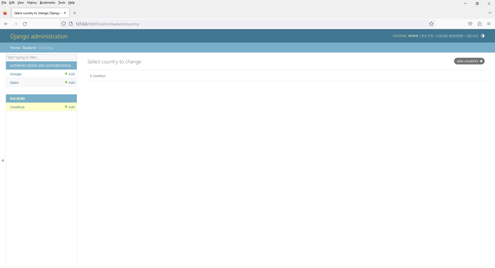
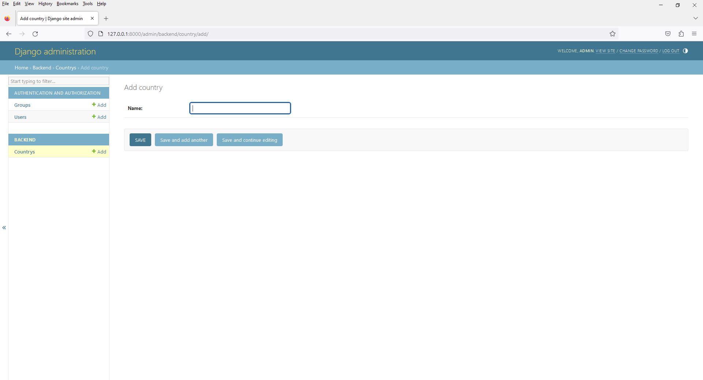
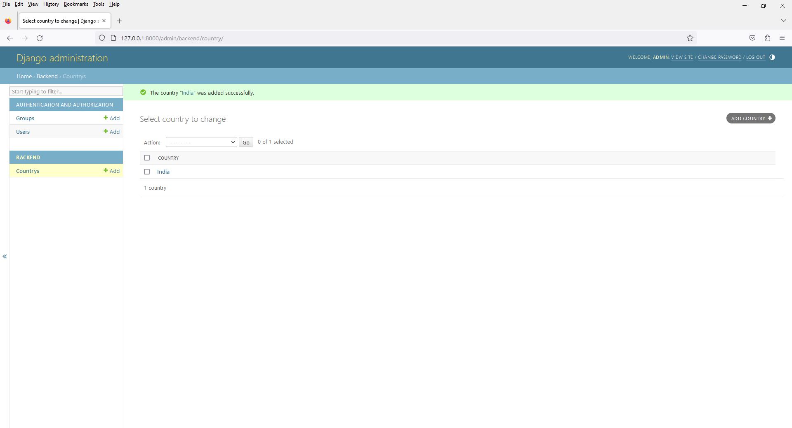
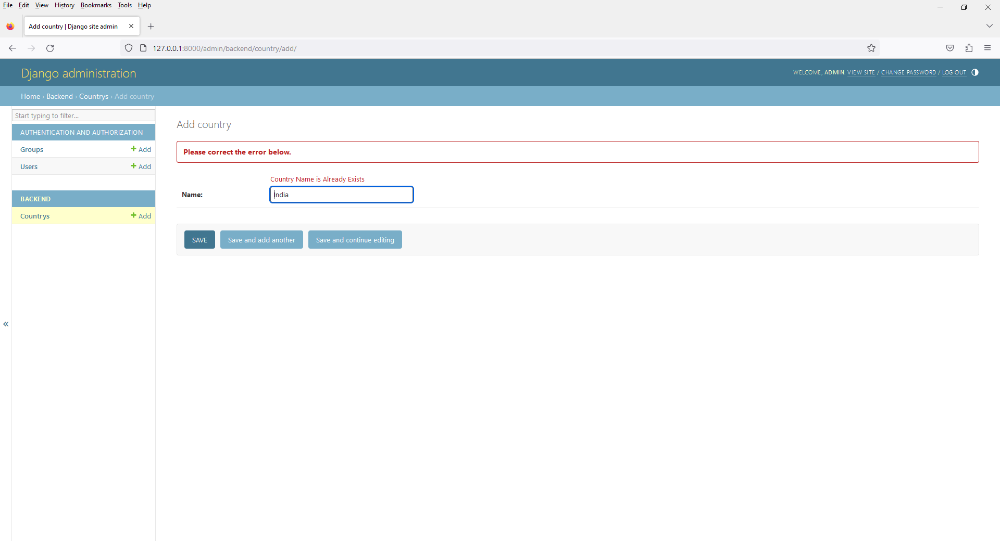

# Chapter 16 - Django Built In Field Validation - error_messages
 










7. open `models.py`

```
from django.db import models

# Create your models here.

class Country(models.Model):
    id = models.BigAutoField(primary_key=True)

    name = models.CharField(
        max_length=255,
        unique=True,
        error_messages = {
            'unique': "Country Name is Already Exists"
        }
    )

    def __str__(self):
        return self.name

    class Meta:
        db_table = 'country'
```

8. open `admin.py`

```
from django.contrib import admin
from .models import Country

# Register your models here.
admin.site.register(Country)
```