# Chapter 2 - Book Shop - Project Setup
 
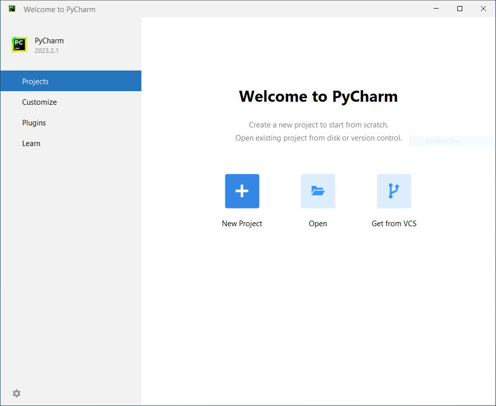

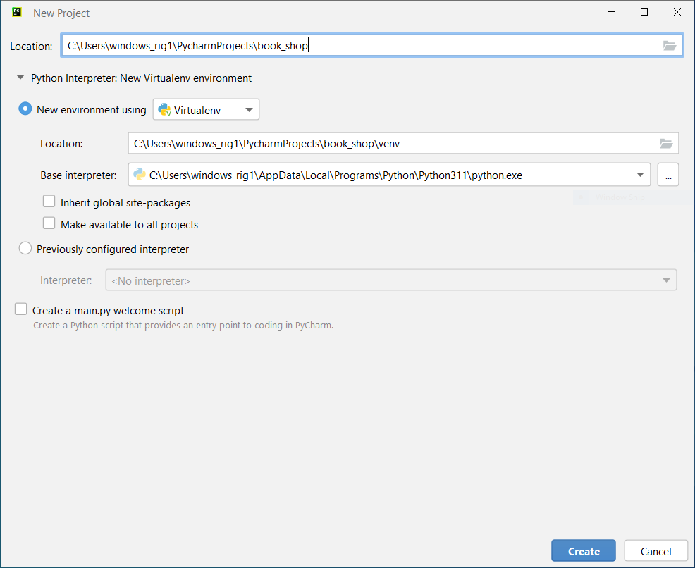

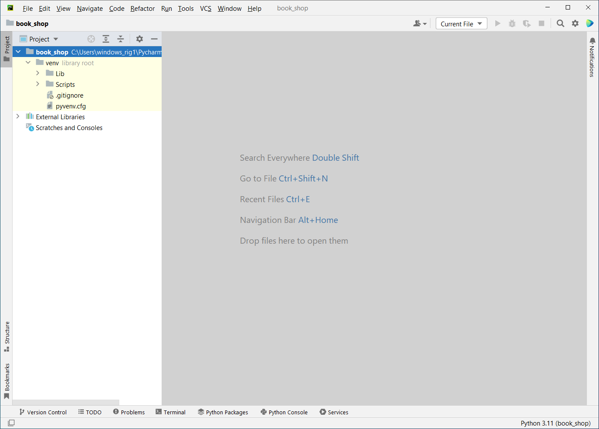

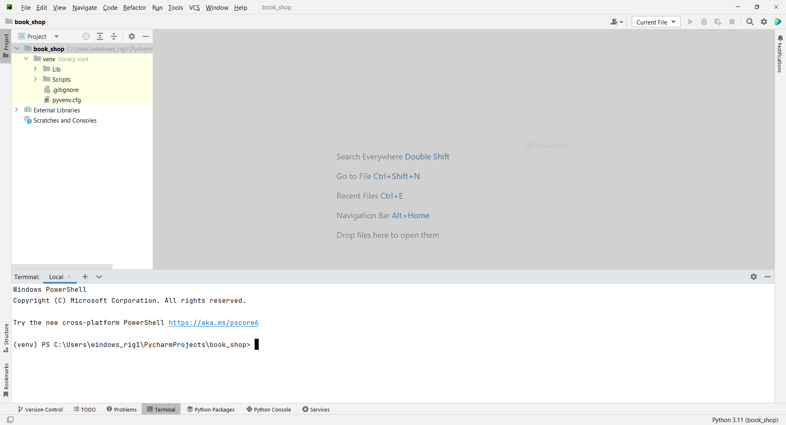

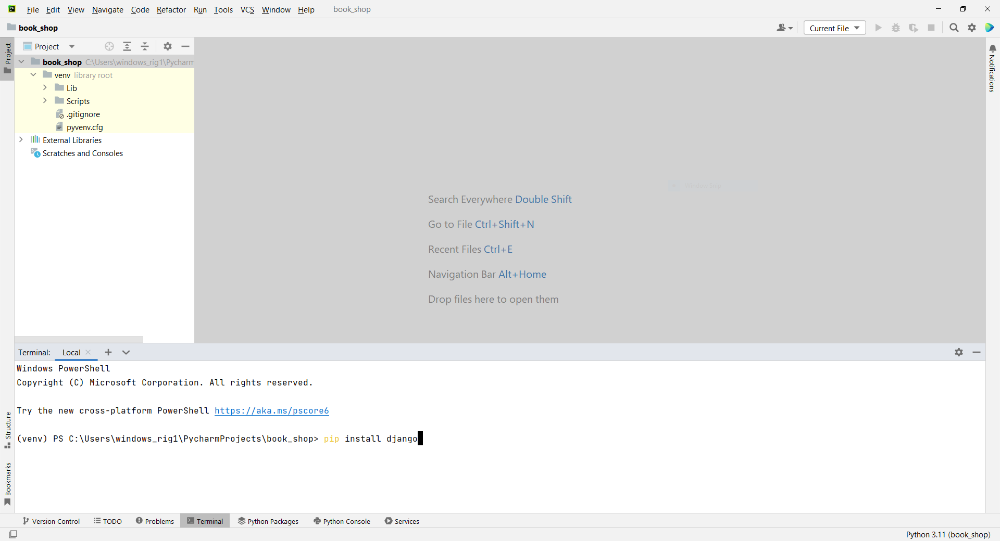

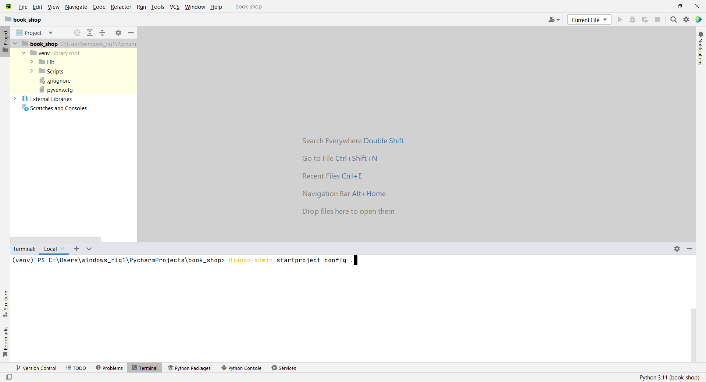

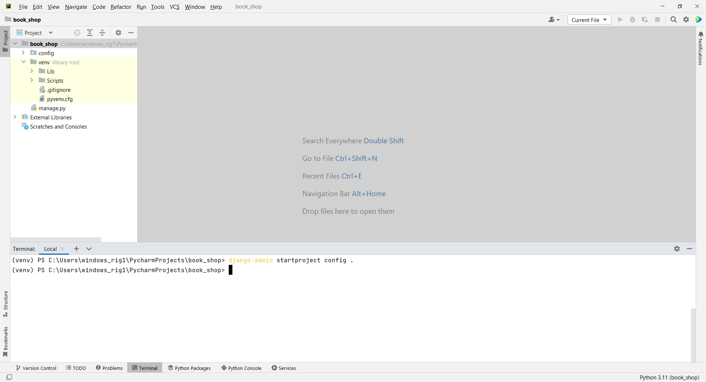

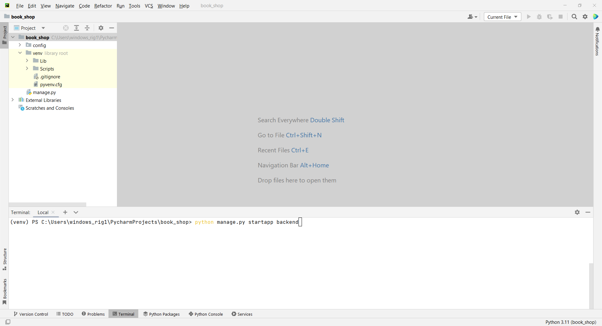

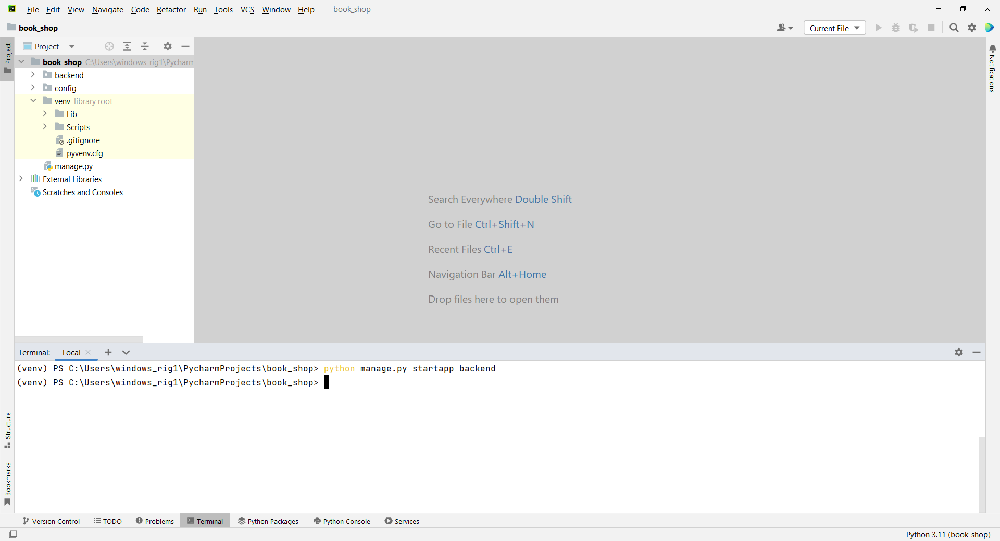

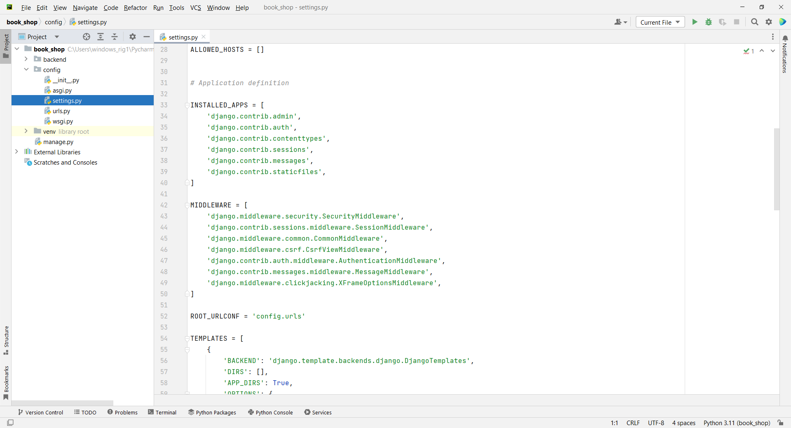

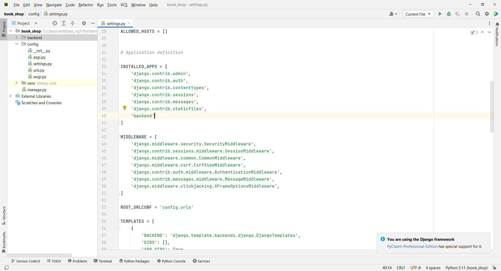

# Project Setup Commands

```
pip install django
```

```
django-admin startproject config .
```

```
python manage.py startapp backend 
```

```
config -> settings.py
```

# Application definition

```
INSTALLED_APPS = [
    'django.contrib.admin',
    'django.contrib.auth',
    'django.contrib.contenttypes',
    'django.contrib.sessions',
    'django.contrib.messages',
    'django.contrib.staticfiles',
    'backend'
]
```