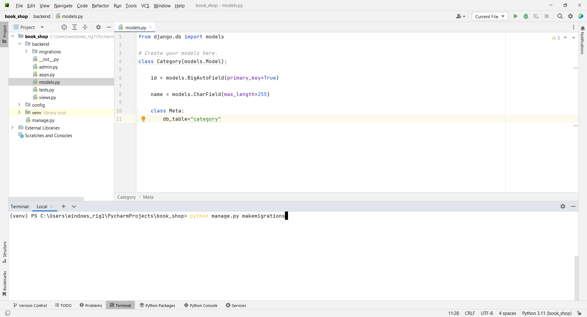
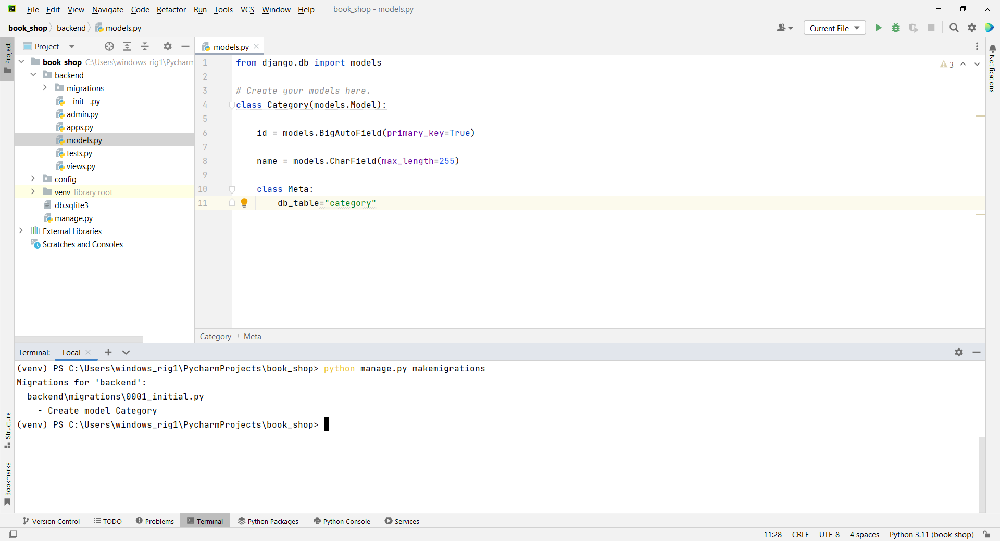
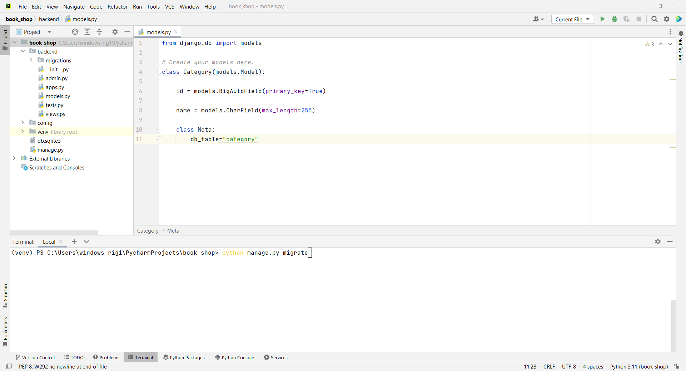
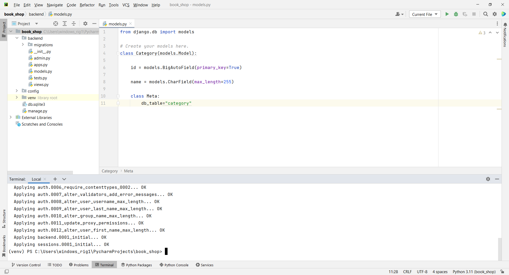

# Chapter 3 - Book Shop - Model Setup
 








5. open `models.py`

```
from django.db import models

class Category(models.Model):

    id = models.BigAutoField(primary_key=True)

    name = models.CharField(max_length=255)

    def __str__(self):
        return self.name

    class Meta:
        db_table = "category"
```

6. Migration Commands

```
python manage.py makemigrations
```

```
Migrations for 'backend':            
  backend\migrations\0001_category.py
    - Create model Category    
```

```
python manage.py migrate
```