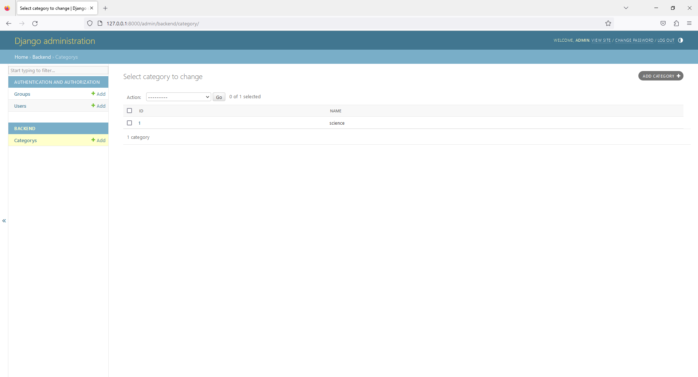
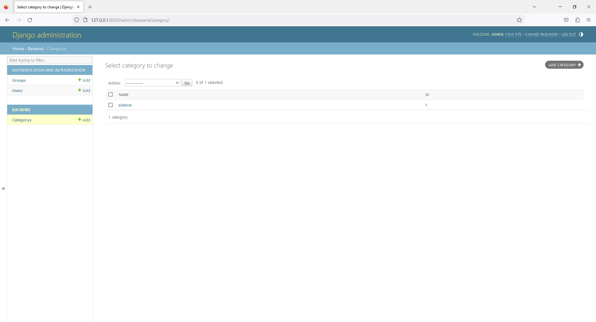

# Chapter 5 - Book Shop - Admin with List Display Feature
 


2. open `admin.py`

```
from django.contrib import admin
from .models import Category

class CategoryAdmin(admin.ModelAdmin):

    list_display = ('id','name')

admin.site.register(Category,CategoryAdmin)
```

4. open `admin.py`

```
from django.contrib import admin
from .models import Category

class CategoryAdmin(admin.ModelAdmin):

    list_display = ('name','id')

admin.site.register(Category,CategoryAdmin)
```

