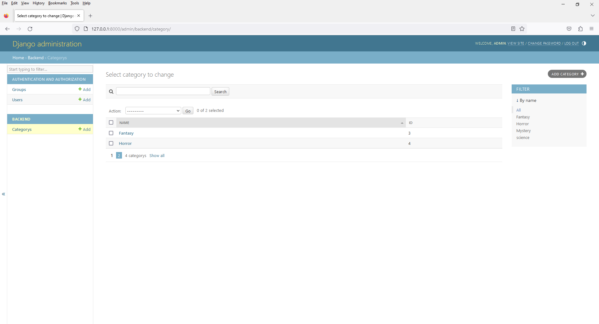

# Chapter 9 - Book Shop - Admin with Pagination Feature
 


2. open `admin.py`

```
from django.contrib import admin
from .models import Category

# Register your models here.
class CategoryAdmin(admin.ModelAdmin):

    list_display = ('name', 'id',)

    # Add filters for name field
    list_filter = ('name',)

    # Add search for name field
    search_fields = ('name',)

    # Sorting by name in ascending order
    ordering = ['name']

    # To sort by name in descending order, use the negative sign
    # ordering = ['-name']

    # Display 2 Category per page
    list_per_page = 2

admin.site.register(Category,CategoryAdmin)
```