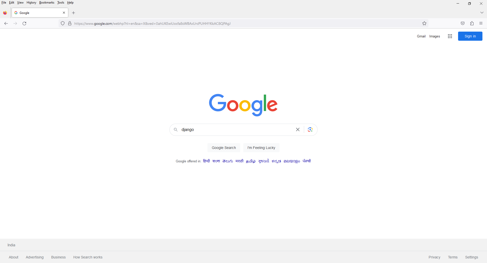
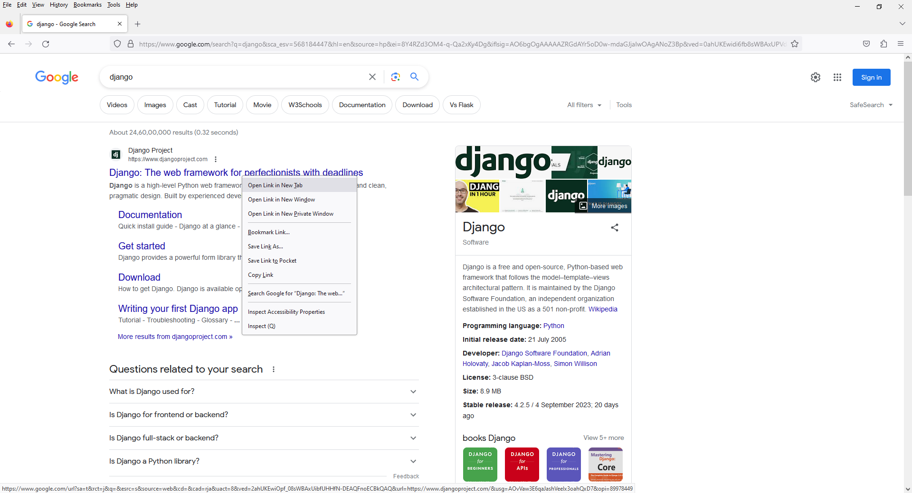
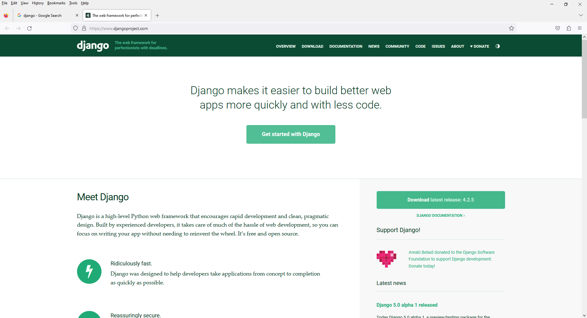

# Chapter 1 - Django Introduction
 




 

### Django Setup - Windows

1) Open Run Window

    ```
    Start + R
    ```

2) Open Command Prompt

    ```
    cmd
    ```

3) Go to Desktop

    ```
    cd Desktop
    ```

4) Create Project Folder and Go to Project Folder

    ```
    mkdir project_name
    ```

    ```
    cd project_name
    ```

5) Create Python Virtual Environment

    ```
    python -m venv venv
    ```

6) Activate Virtual Environment

    ```
    cd venv/Scripts 
    ```

    ```
    activate
    ```

    ```
    cd..
    ```

    ```
    cd..
    ```

    OR

    ```
    cd venv/Scripts && activate && cd.. && cd..
    ```

7) Install Django

    ```
    pip install django
    ```

8) Create Django Config Folder

    ```
    django-admin startproject config .
    ```

9) Create Backend App

    ```
    python manage.py startapp backend
    ```

10) Open VSCode

    ```
    code .
    ```

### Django Setup - Linux

1) Open Activities

    ```
    START 
    ```

2) Open Terminal

    ```
    terminal
    ```

3) Go To Desktop

    ```
    cd Desktop
    ```

4) Check Python is Installed or Not

    ```
    which python
    ```

    or

    ```
    which python3
    ```

5) Create Folder

    ```
    mkdir folder_name
    ```

6) Go To Folder

    ```
    cd folder_name
    ```

7) Install Python Virtual Environment

    ```
    sudo apt install python3.10-venv
    ```

8) Create Python Virtual Environment

    ```
    python -m venv venv
    ```

9) Activate Virtual Environment

    ```
    cd venv/bin
    ```

    ```
    source activate
    ```

    ```
    cd..
    ```

    ```
    cd..
    ```

    OR

    ```
    cd venv/bin && source activate && cd.. && cd..
    ```

    OR

    ```
    source venv/bin/activate
    ```