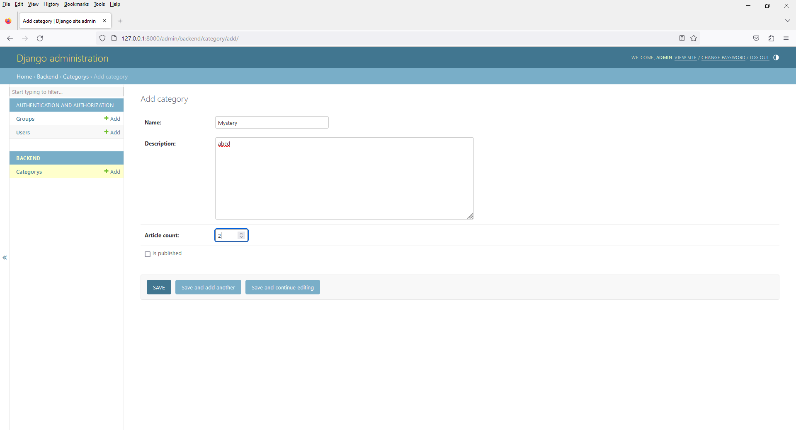
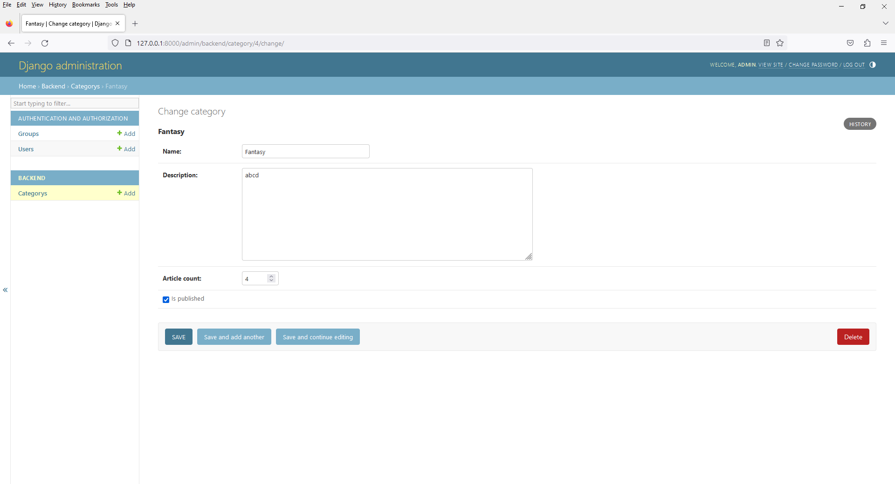
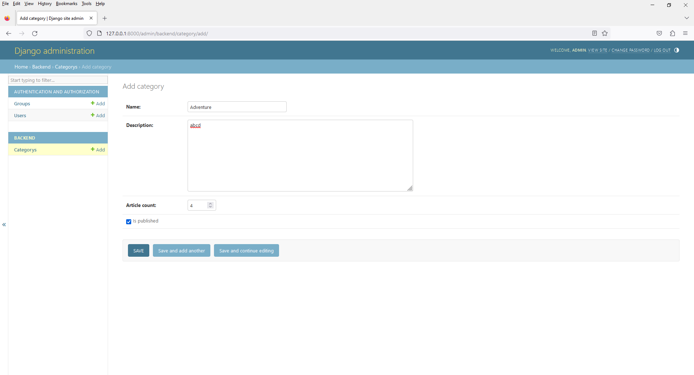
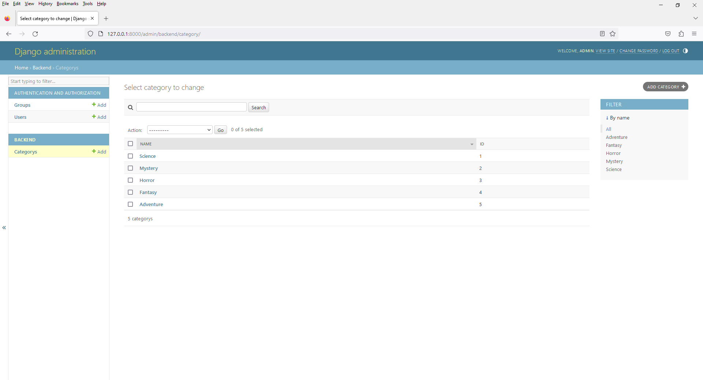
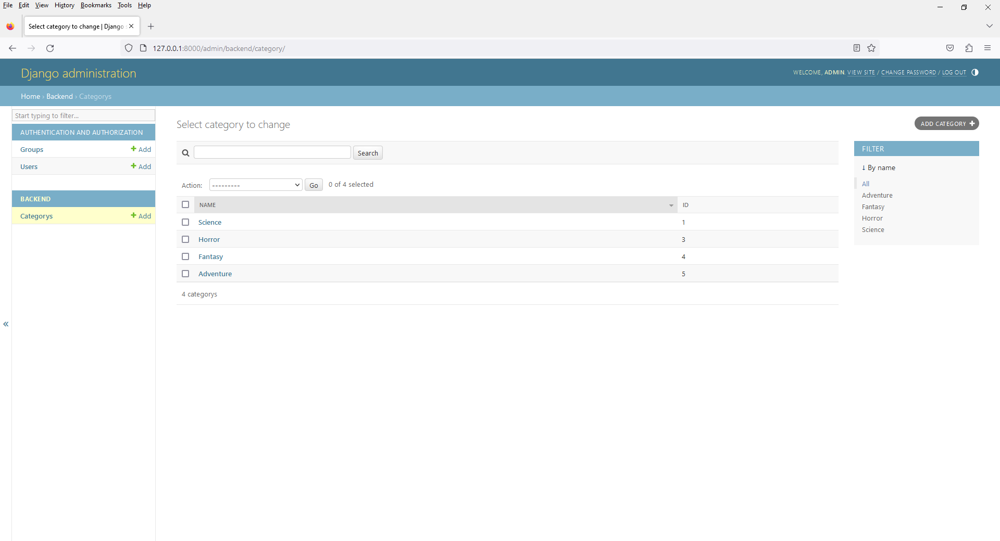
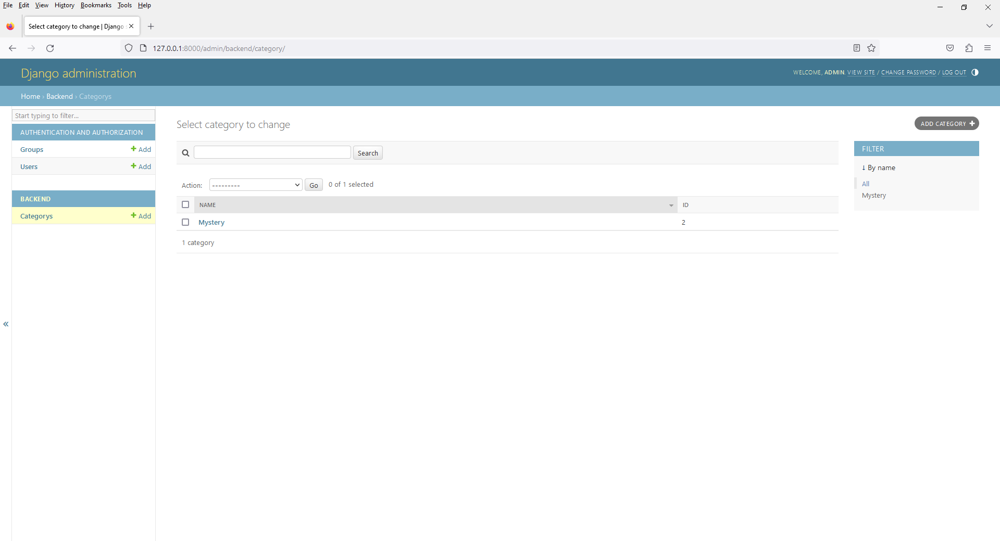

# Chapter 10 - Book Shop - Admin with Override Default Queryset Feature
 
1. open `models.py`

```
from django.db import models

class Category(models.Model):

    id = models.BigAutoField(primary_key=True)

    name = models.CharField(max_length=100)

    description = models.TextField()

    article_count = models.IntegerField()

    is_published = models.BooleanField(default=False)

    def __str__(self):
        return self.name

    class Meta:
        db_table = 'category'
```











8. open `admin.py`

```
from django.contrib import admin
from .models import Category

# Register your models here.
class CategoryAdmin(admin.ModelAdmin):

    list_display = ('name', 'id',)

    # Add filters for name field
    list_filter = ('name',)

    # Add search for name field
    search_fields = ('name',)

    # Sorting by name in ascending order
    ordering = ['name']

    # To sort by name in descending order, use the negative sign
    # ordering = ['-name']

admin.site.register(Category,CategoryAdmin)
```



10. open `admin.py`

```
from django.contrib import admin
from .models import Category

# Register your models here.
class CategoryAdmin(admin.ModelAdmin):

    list_display = ('name', 'id',)

    # Add filters for name field
    list_filter = ('name',)

    # Add search for name field
    search_fields = ('name',)

    # Sorting by name in ascending order
    # ordering = ['name']

    # To sort by name in descending order, use the negative sign
    ordering = ['-name']

    def get_queryset(self, request):
        qs = super().get_queryset(request)
        # You can customize the queryset here, e.g., add annotations or filters
        return qs.filter(is_published=True)

admin.site.register(Category,CategoryAdmin)
```



12. open `admin.py`

```
from django.contrib import admin
from .models import Category

# Register your models here.
class CategoryAdmin(admin.ModelAdmin):

    list_display = ('name', 'id',)

    # Add filters for name field
    list_filter = ('name',)

    # Add search for name field
    search_fields = ('name',)

    # Sorting by name in ascending order
    # ordering = ['name']

    # To sort by name in descending order, use the negative sign
    ordering = ['-name']

    def get_queryset(self, request):
        qs = super().get_queryset(request)
        # You can customize the queryset here, e.g., add annotations or filters
        return qs.filter(is_published=False)

admin.site.register(Category,CategoryAdmin)
```

13. Override Default Queryset

get_queryset(self, request): This method allows you to customize the queryset used to fetch categories in the admin interface. In this case, it filters the queryset to only include categories where the is_published field is set to True. This can be useful if you want to restrict what data is displayed in the admin interface based on certain criteria.