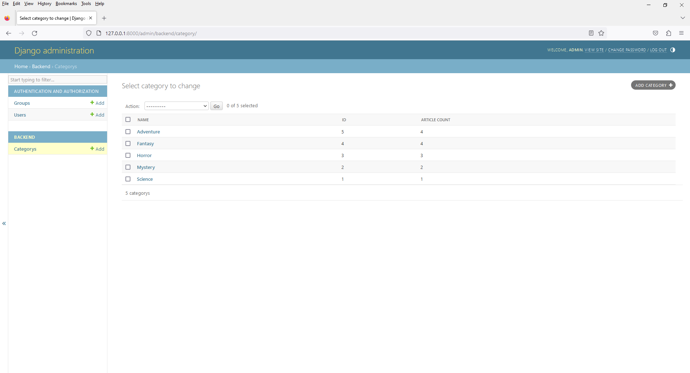

# Chapter 11 - Book Shop - Admin with Customize Display Feature
 


2. open `admin.py`

```
from django.contrib import admin
from .models import Category

# Register your models here.
class CategoryAdmin(admin.ModelAdmin):

    list_display = ('name', 'id', 'article_count',)

    def article_count(self, obj):
        return obj.article_set.count()

    # Custom column name
    article_count.short_description = 'Number of Articles'

admin.site.register(Category,CategoryAdmin)
```

3. Customize Display

You can customize the way topics are displayed in the list by adding additional fields to the list_display attribute or using custom methods. For instance, you can display a count of related objects (e.g., the number of articles associated with each topic):