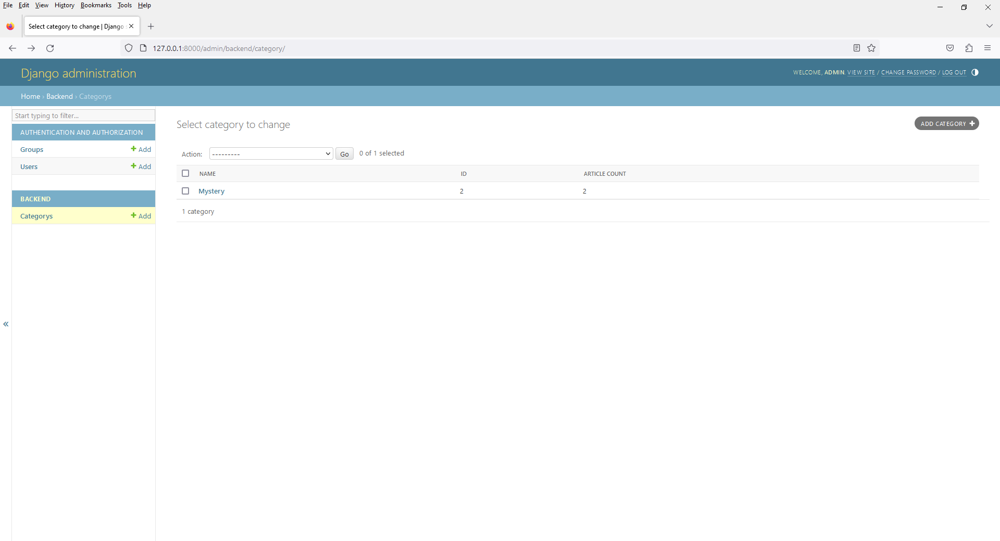
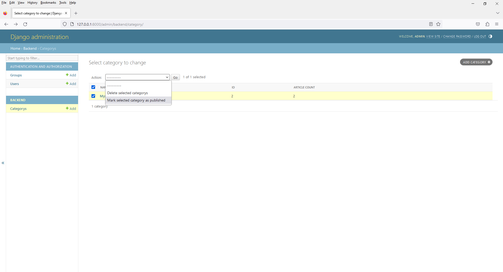
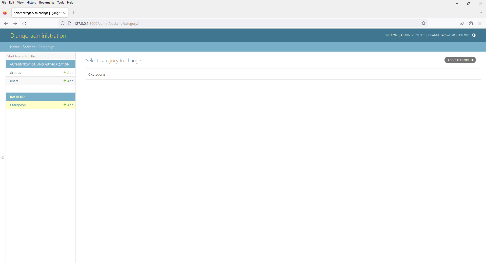
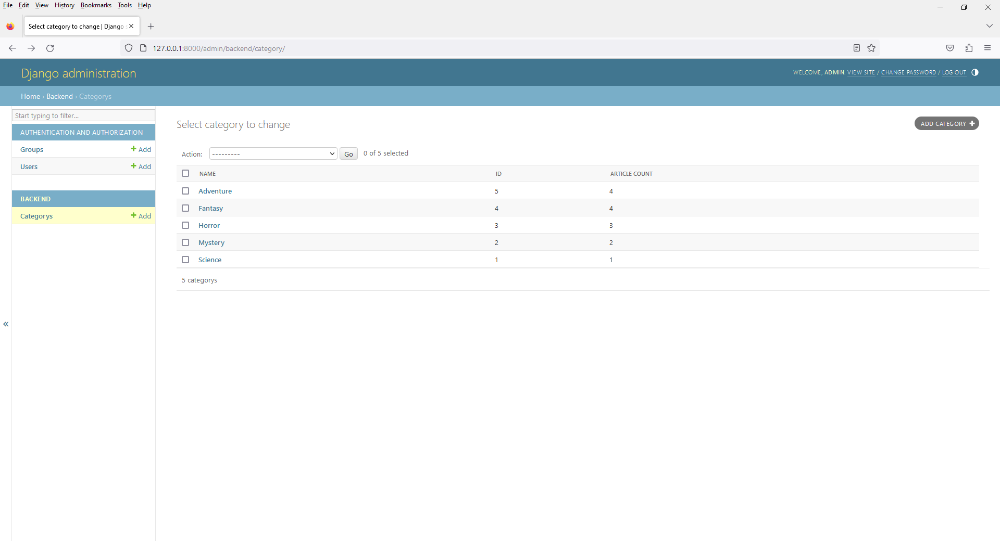
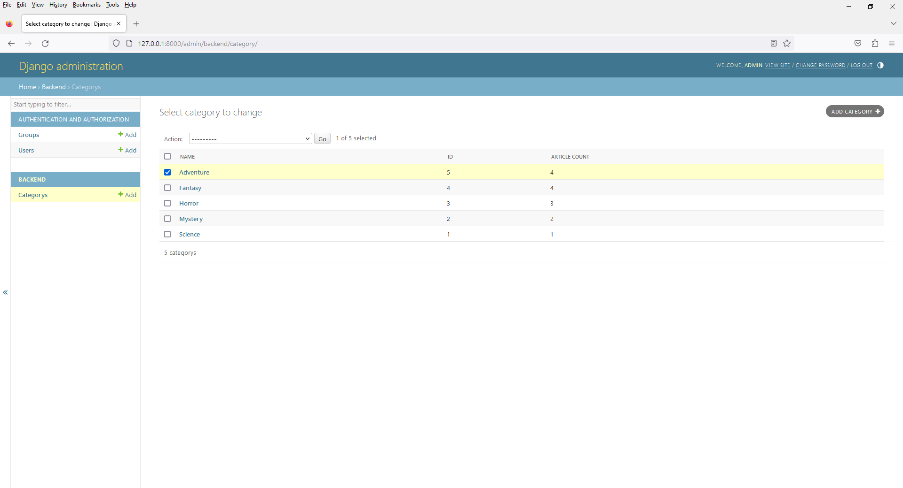
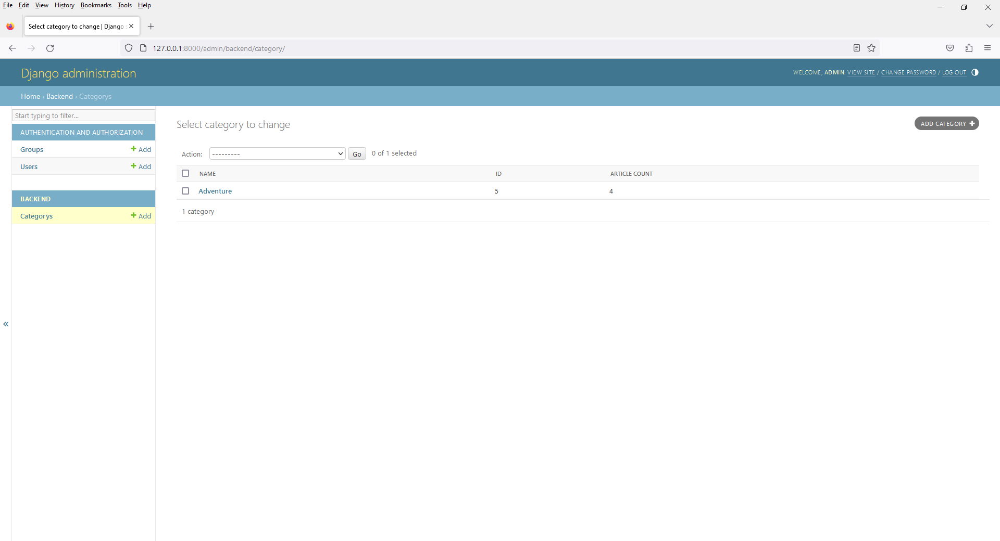

# Chapter 12 - Book Shop - Admin with Actions Feature
 






4. open `admin.py`

```
from django.contrib import admin
from .models import Category

# Register your models here.
class CategoryAdmin(admin.ModelAdmin):

    list_display = ('name', 'id', 'article_count',)

    def get_queryset(self, request):
        qs = super().get_queryset(request)
        # You can customize the queryset here, e.g., add annotations or filters
        return qs.filter(is_published=False)

    def mark_as_featured(self, request, queryset):
        queryset.update(is_published=True)

    mark_as_featured.short_description = 'Mark selected category as published'

    actions = [mark_as_featured]

admin.site.register(Category,CategoryAdmin)
```








5. open `admin.py`

```
from django.contrib import admin
from .models import Category

# Register your models here.
class CategoryAdmin(admin.ModelAdmin):

    list_display = ('name', 'id', 'article_count',)

    def get_queryset(self, request):
        qs = super().get_queryset(request)
        # You can customize the queryset here, e.g., add annotations or filters
        return qs.filter(is_published=False)

    def mark_as_published(self, request, queryset):
        queryset.update(is_published=True)

    mark_as_published.short_description = 'Mark selected category as published'

    def mark_as_unpublished(self, request, queryset):
        queryset.update(is_published=False)

    mark_as_unpublished.short_description = 'Mark selected category as unpublished'

    actions = [mark_as_published, mark_as_unpublished]

admin.site.register(Category,CategoryAdmin)
```

10. Actions

You can customize the way topics are displayed in the list by adding additional fields to the list_display attribute or using custom methods. For instance, you can display a count of related objects (e.g., the number of articles associated with each topic):