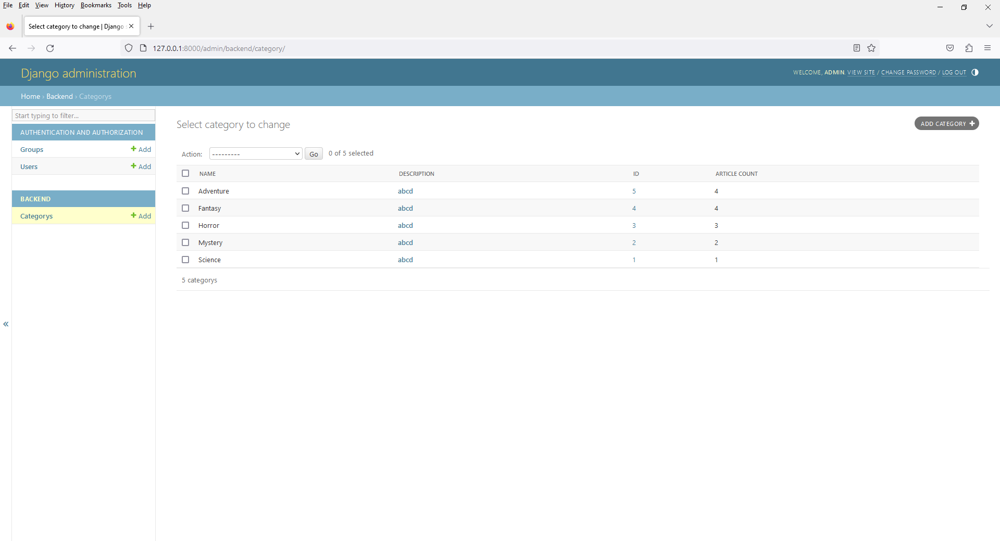

# Chapter 13 - Book Shop - Admin with List Display Links Feature
 


2. open `admin.py`

```
from django.contrib import admin
from .models import Category


# Register your models here.
class CategoryAdmin(admin.ModelAdmin):
    list_display = ('name', 'description', 'id', 'article_count',)

    # Specify 'name' as the field to be linked to the change view
    list_display_links = ('id', 'description')

admin.site.register(Category, CategoryAdmin)
```

3. List Display Links

In Django's admin interface, the list_display_links attribute is used to specify which field(s) in the list view of a model's admin page should be clickable and lead to the detail/change view of that particular item when clicked.