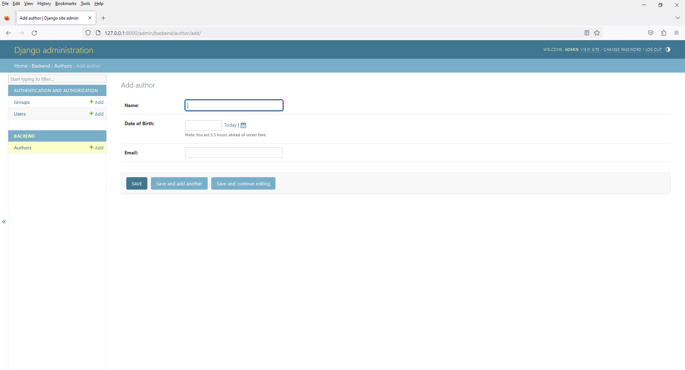
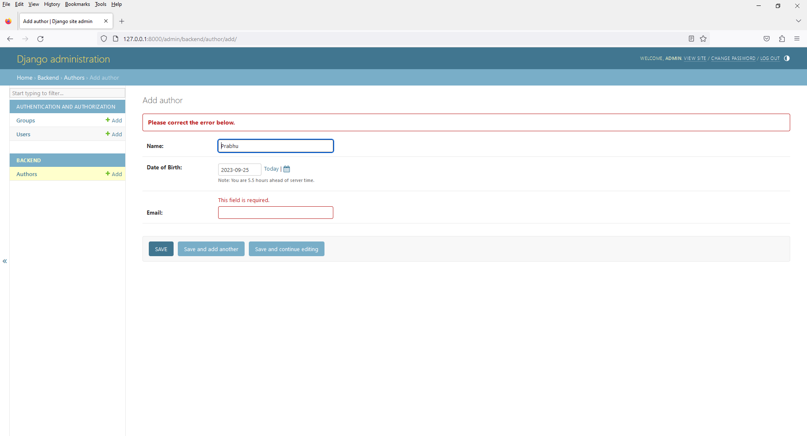
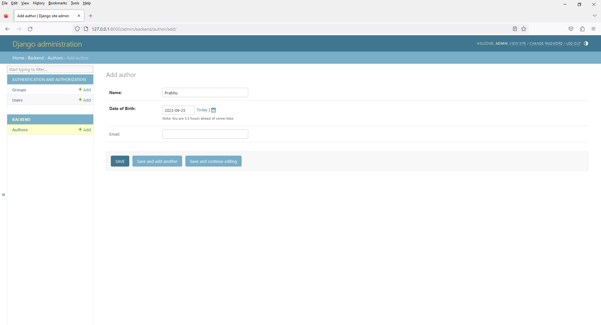
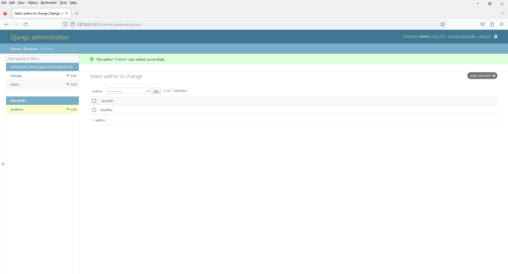
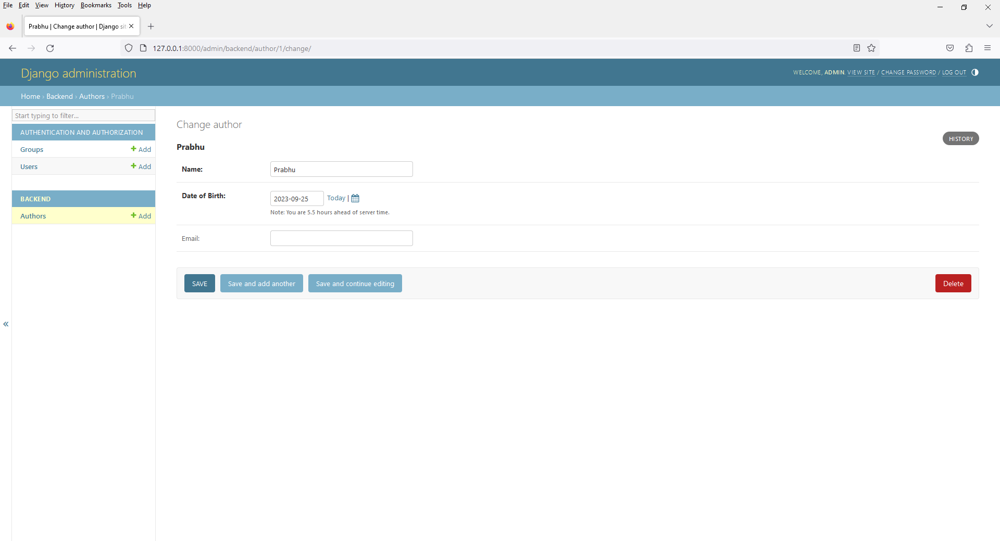

# Chapter 18 - Django Built In Field Validation - null and blank
 











7. open `models.py`

```
from django.db import models

# Create your models here.

class Author(models.Model):
    id = models.BigAutoField(primary_key=True)

    name = models.CharField(max_length=255)

    dob = models.DateField(
        verbose_name="Date of Birth"
    )

    # Allow the email field to be null in the database and not required in forms.
    email = models.EmailField(
        null=True,
        blank=True,
    )

    def __str__(self):
        return self.name

    class Meta:
        db_table = "author"
```

8. open `admin.py`

```
from django.contrib import admin
from .models import Author

# Register your models here.
admin.site.register(Author)
```