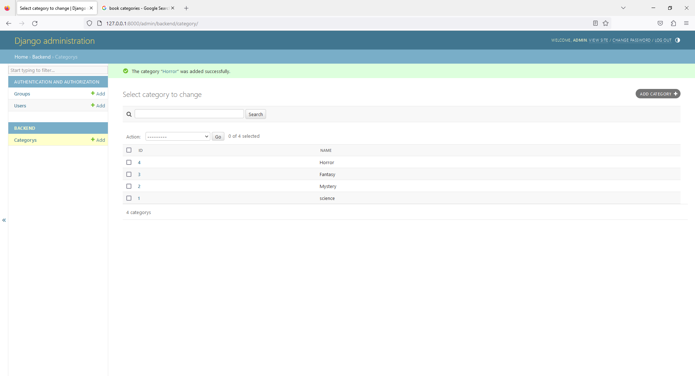
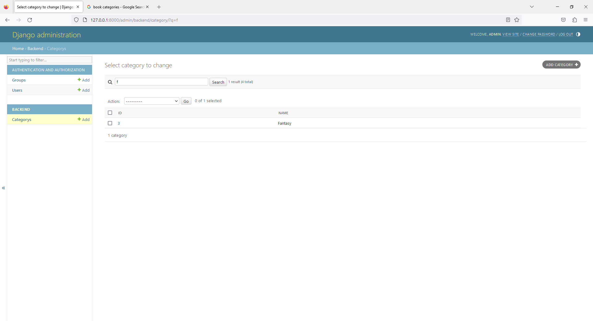

# Chapter 6 - Book Shop - Admin with Search Feature
 




3. open `admin.py`

```
from django.contrib import admin
from .models import Category

# Register your models here.
class CategoryAdmin(admin.ModelAdmin):

    list_display = ('name','id')

    # Add search for name field
    search_fields = ('name',)

admin.site.register(Category,CategoryAdmin)
```